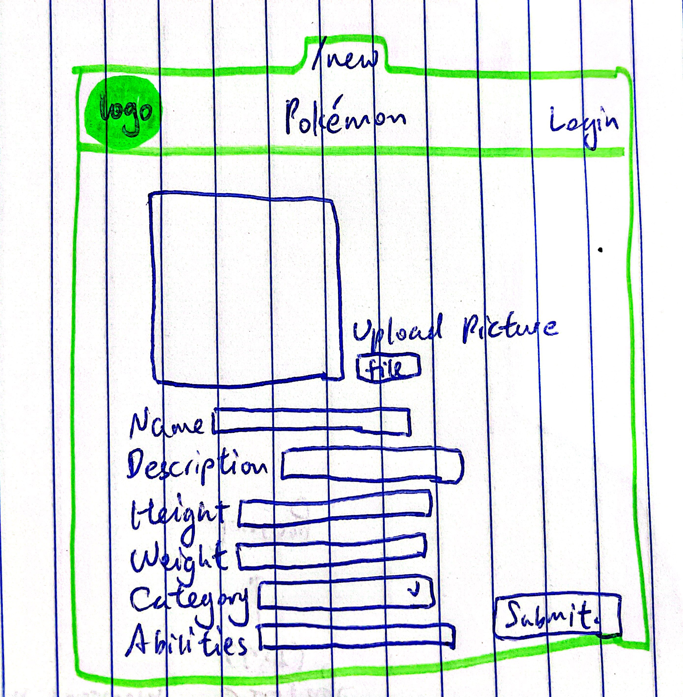
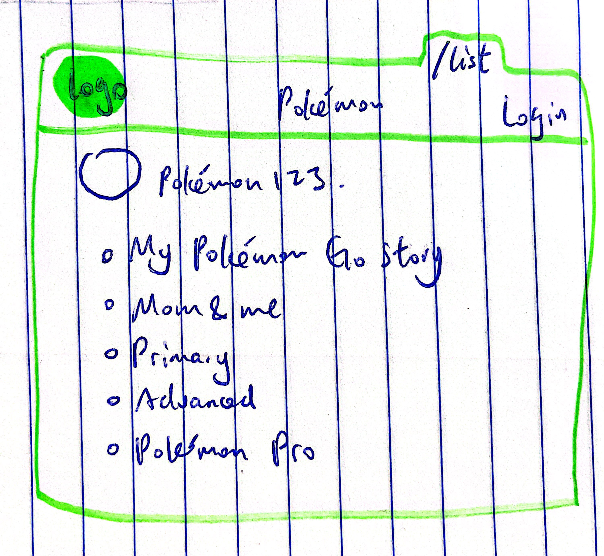
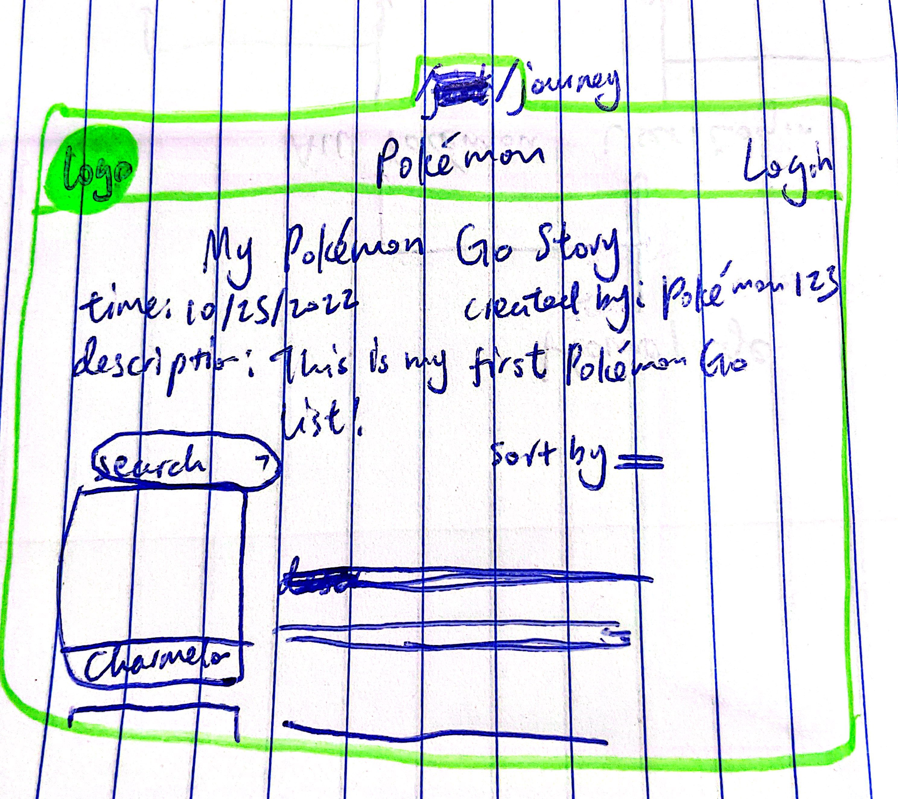
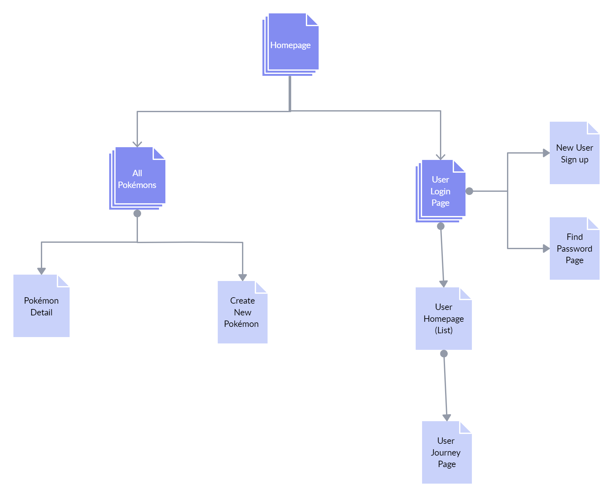

# My Pokémon Story App 

## Overview

Pokémon is such a thing: you collect Pokémon cards as a kid, you watch Pokémon anime in elementary school, and you catch wild Pokémon with your friends in high school. You may not be able to say your first favorite Pokémon anymore, but the success of this brand has made Pokémon an unforgettable part of we Gen Z's childhood.

The My Pokémon Story app will let you keep those memories. This app can really do anything. Once logged in, you can list every Pokémon you've collected and your memories of them. You can also create your personalized Pokémon by giving it a name, weight, type, ability, and more. They are then uploaded to the Pokémon database and displayed to Pokémon lovers all over the world.


Technical tools: Javascript, Express, Handlebars.js, CSS, MongoDB, Web API

## Data Model

The application will store Users, Lists and Pokémons.

* users can have multiple lists (via references)
* each list can have multiple Pokémons (by embedding)
* each Pokémon is an object with facts and pictures associated with it

An Example User:

```javascript
{
  username: "PokémonStan123",
  password: // a password hash,
  lists: [ list1, list2, list3 ]
}
```

An Example List with Embedded Pokémons:

```javascript
{
  user: // a reference to a User object
  name: "My Pokémon Go Journey ",
  pokemons: [
    {
     pokemon: //reference to a Pokémon object,
     description: "I found him in high school's parking lot. James also have one.",
     like: true,
     createdAt: // timestamp
    }
    {
     pokemon: //reference to a Pokémon object,
     description: "I taught mom how to use Pokémon Go and she caught her in our kitchen. It was so much fun!",
     like: false,
     createdAt: // timestamp
    }
  ],
  createdAt: // timestamp
}
```

An Example Pokémon:

```JSON
{
   "id": 1,
  "name": "cheri",
  "growth_time": 3,
  "max_harvest": 5,
  "natural_gift_power": 60,
  "size": 20,
  "smoothness": 25,
  "soil_dryness": 15,
  "firmness": {
   "name": "soft",
   "url": "https://pokeapi.co/api/v2/berry-firmness/2/"
    }
    "created_by": "system",
    "picture": "https://archives.bulbagarden.net/media/upload/thumb/a/a7/420Cherubi.png/375px-420Cherubi.png”
}
```

## [Link to Commented First Draft Schema](db.mjs) 

(__TODO__: create a first draft of your Schemas in db.mjs and link to it)

## Wireframes

/all - page for showing all saved Pokémons 


/new - page for creating a personalized Pokémon



/list - page for showing all lists



/journey - page for creating Pokémon stories and exporting them



## Site map



## User Stories or Use Cases

1. as non-registered user, I can browse and see the Pokémon database
2. as non-registered user, I can register a new account with the site
3. as a user, I can log in to the site
4. as a user, I can create a new Pokémon list
5. as a user, I can view all of the Pokémon lists I've created in a single list
6. as a user, I can add items to an existing Pokémon list and add a short descripton to it
7. as a user, I can delete items from an existing Pokémon list
8. as a user, I can export a Pokémon list with my descriptons in the JPG/PNG/PDF and other formats
9. as a user, I can create my own Pokémon to the Pokémon database

## Research Topics

* (3 points) Integrate user authentication
    * I'm going to be using email passport for user authentication
    * And account has been made for testing; I'll email you the password
    * I'm going to use external APIs to email you new passwords if you forgot your password
* (4 points) Perform client side form validation using a JavaScript library
    * if you put in a description that's longer than 300 characters, an error message will appear in the dom
    * if you create Pokémons with no attributes, an error message will appear when submitting
    * if you log in with wrong email-password pairs, an error message will appear when logging in
* (4 points) Find good API for Pokémon information and user authentication
    * I need to find an API that can send back all Pokémons' information
    * I need to find an API that can help send emails to users' emails for authentication
* (2 points) React
    * Research about React front-end framework

 13 points total out of 8 required points 

## Progress currently Made:
* Connected to PokeAPI to access Pokemon information. Applied results on /all and /detail page.
* Researched Pagination algorithms and applied jw-paginate.js on /all page.
* Researched about making requests and passing query strings to webpages. Successfully passed parameters (pokemon id and subpage id) through website url.
* Researched about handlebars.js section-helper to help connect each page with their individual css and js file.
* Researched about importing js modules. (failed, was not able to connect modules. So I copied and pasted the entire function into my js file. Need further inspection.)
* Researched about how to vertically center an element. (margin: auto)
* Researched about adding horizontally scrolling image to homepage.
* Researched and troubleshot deploying on heroku and connecting to MongoDB Atlas. Turned out that there should not be any brackets around the user password in MongoDB Connection String (.env), and .env files are not commited, so we set up config values in heroku dashboard.
* Researched about javascript animation.

## [Link to Initial Main Project File](app.mjs) 

## Annotations / References Used

1. [jw-paginate.js pagination algorithm](https://jasonwatmore.com/post/2018/08/07/javascript-pure-pagination-logic-in-vanilla-js-typescript) - (added pagination to /all pokemon page based on this algorithm)
2. 

